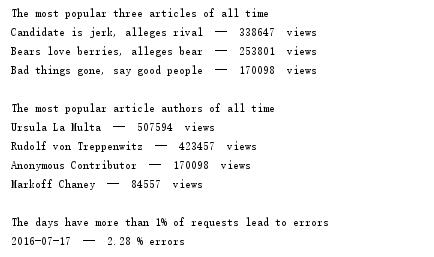

# Logs Analysis

This Project was created for my Udacity Nanodegree. It was built for data analysis for a news database log.

## Sample Output

## Author

* [Zhiyuan Du](https://github.com/lYesterdaYl)

## Installation

1. Clone the repository.
2. Run main.py

## Built With

* [psycopg2](http://initd.org/psycopg/docs/) - Used to connect to the Postgresql database

## License

This project is licensed under the Apache 2.0 License - see the [LICENSE.md](LICENSE.md) file for details